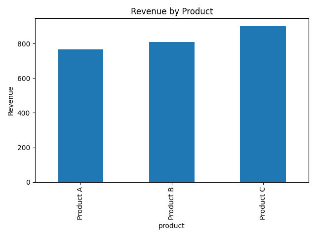

# Task 7: Sales Summary using SQLite and Python

## 📌 Objective
Analyze basic sales data using SQL inside Python and visualize the result.

## 🛠 Tools Used
- Python
- SQLite (sqlite3)
- pandas
- matplotlib
- Google Colab

## 🧮 What It Does
- Creates a SQLite database with sample sales data
- Executes SQL to summarize product-wise quantity and revenue
- Loads data into a pandas DataFrame
- Visualizes revenue using a bar chart

## 📊 Output

## Files Included
- `task7_sales_summary.ipynb` – Colab notebook
- `sales_data.db` – Sample database
- `sales_chart.png` – Bar chart of product revenue
